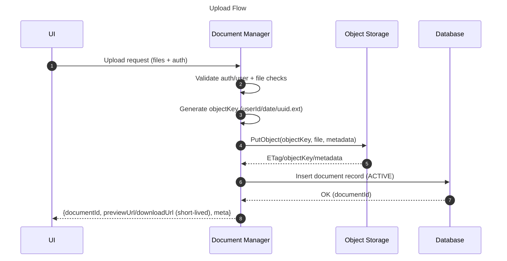
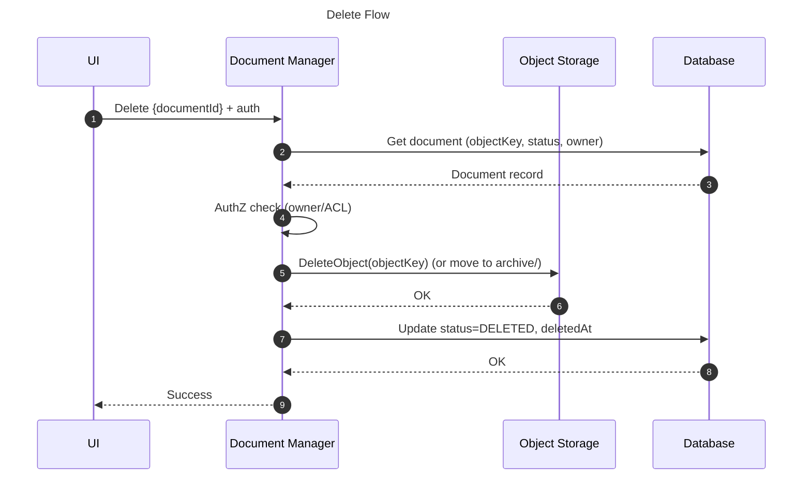
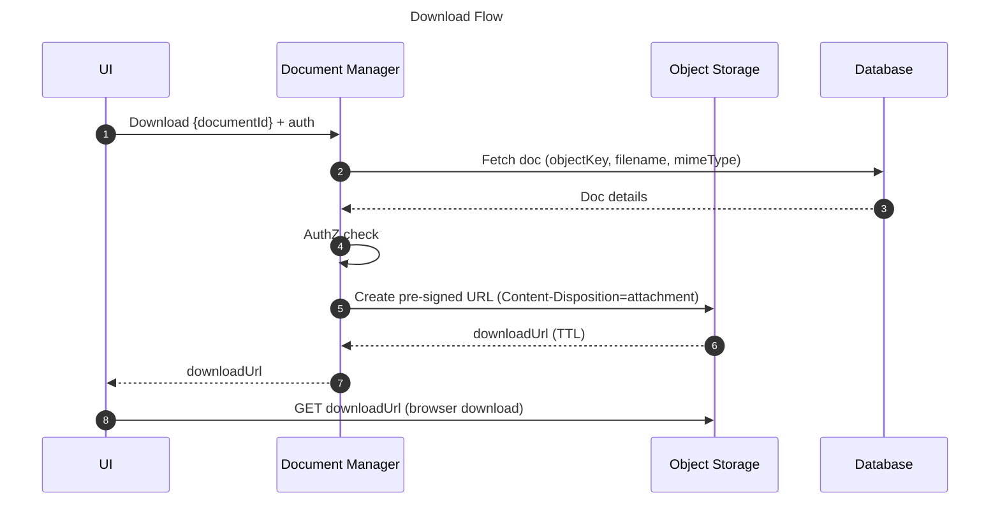
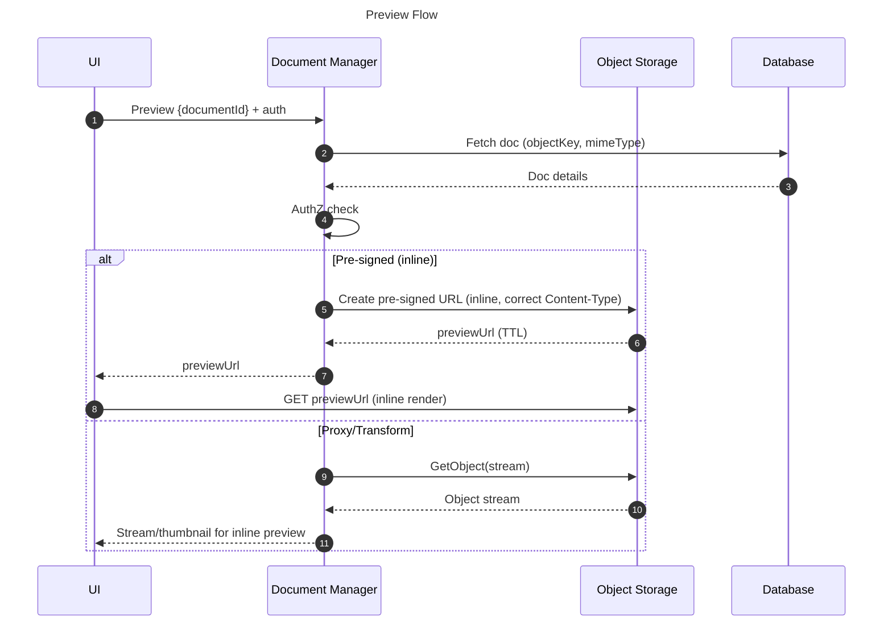

# Document Manager

## Purpose

Provide a centralized, secure, and scalable service that manages the full lifecycle of user documents—upload, organization, storage in object storage, controlled access for preview/download via short-lived URLs, and metadata persistence in the database—acting as the bridge between the UI, storage, and database.

## Componets Used

- **Student Web App (PWA)** – front-end that initiates file upload, preview, download, delete  
- **Student Dashboard Page** – UI layer where students interact with document features  
- **API** – orchestrates document operations (receives requests, applies auth, interacts with storage/DB)  
- **Object Storage** – stores the actual document binaries (PDFs, images, certifications)  
- **Database Schema** – stores metadata about uploaded documents (URLs/keys, ownership, status, timestamps)  

## Dependency

- Sign Up & Sign-In Controller

## Document Manager — Process Flows

### 1) Upload Flow

#### Steps

1. **UI**: User clicks **Upload** and selects files (PDF/image/camera).
2. **UI → Document Manager**: Send multipart (or initiate pre-signed PUT) with auth token.
3. **Document Manager**: Verify auth → derive `userId` → validate size/type → (optional) virus/DLP scan.
4. **Document Manager**: Generate unique object key `userId/yyyy/mm/dd/uuid.ext`.
5. **Document Manager → Object Storage**: Upload object (set metadata, SSE/KMS).
6. **Object Storage → Document Manager**: Return object key / ETag / metadata.
7. **Document Manager → DB**: Insert record (documentId, userId, objectKey, filename, mime, size, createdAt, status=ACTIVE).
8. **Document Manager → UI**: Return `{documentId, filename, previewUrl/downloadUrl (short-lived), metadata}`.

### 2) Delete Flow

1. **UI**: User clicks **Delete** on a document.
2. **UI → Document Manager**: Request delete `{documentId}` with auth.
3. **Document Manager**: Verify auth & ownership → read DB → ensure `status != DELETED`.
4. **Document Manager → Object Storage**: Delete object (or move to `archive/` for soft-delete).
5. **Document Manager → DB**: Update record `status=DELETED`, `deletedAt` (retain audit).
6. **Document Manager → UI**: Return success (optionally refreshed list).

### 3) Download Flow

1. **UI**: User clicks **Download**.
2. **UI → Document Manager**: Request download `{documentId}` with auth.
3. **Document Manager**: Verify auth & ownership → fetch `objectKey`, `filename`, `mimeType`.
4. **Document Manager**: Generate short-lived **pre-signed URL** (or stream) with `Content-Disposition=attachment; filename="original.ext"`.
5. **Document Manager → UI**: Return `downloadUrl`.
6. **UI**: Browser initiates file download.

### 4) Preview Flow

1. **UI**: User clicks **Preview** (thumbnail/open).
2. **UI → Document Manager**: Request preview `{documentId}` with auth.
3. **Document Manager**: Verify auth & ownership → fetch `objectKey`, `mimeType`.
4. **Document Manager**:
   - **Option A**: Generate **pre-signed URL** with `Content-Disposition=inline` and correct `Content-Type`.
   - **Option B**: Proxy/stream the object; optionally transform (image resize, PDF first-page thumbnail).
5. **Document Manager → UI**: Return `previewUrl` (or stream).
6. **UI**: Render: `` for images; PDF viewer/`<iframe>` for PDFs; cache thumbnails if available.

