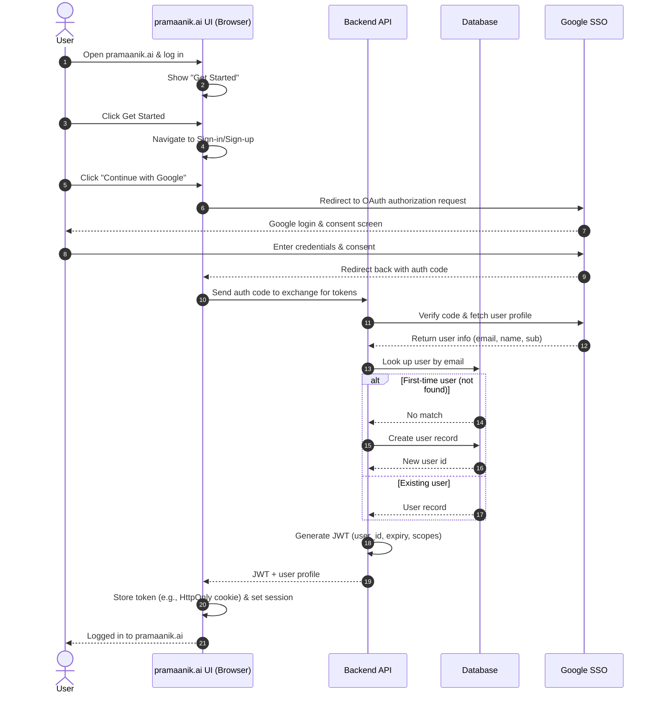

# Sign Up & Sign-In Controller

## Purpose

## Componets Used

## Dependency

## Process Diagram

## Process Steps

## 1) Sign-up or Sign-in with Google

### Process Flow

### Sequential Steps

1. User opens **pramaanik.ai** and initiates login.  
2. UI shows a **Get Started** action.  
3. User clicks **Get Started**.  
4. UI navigates to the **Sign-in / Sign-up** page.  
5. User clicks **Continue with Google**.  
6. UI redirects the browser to **Google OAuth** (authorization request).  
7. Google displays the **login/consent** screen.  
8. User enters Google credentials and grants consent.  
9. Google redirects back to pramaanik.ai with an **authorization code**.  
10. UI sends the **auth code** to the **Backend API** to exchange for tokens (server-side).  
11. Backend calls **Google** to verify the code and fetch the user’s **profile (email, name, sub/id)**.  
12. Google returns the verified **user info** to the backend.  
13. Backend queries the **Database** for a user record by **email**.  
14. **If no user found** (first time):  
    - Backend creates a **new user record** in the database.  
    - Proceed to token generation.  
15. **If user exists**:  
    - Backend loads the existing **user record**.  
16. Backend generates a **JWT** (e.g., includes user_id, expiry, claims).  
17. Backend returns the **JWT + user profile** to the UI.  
18. UI **stores** the JWT (e.g., HttpOnly cookie / secure storage) and sets the **session**.  
19. UI updates state and displays the **logged-in** experience to the user.
