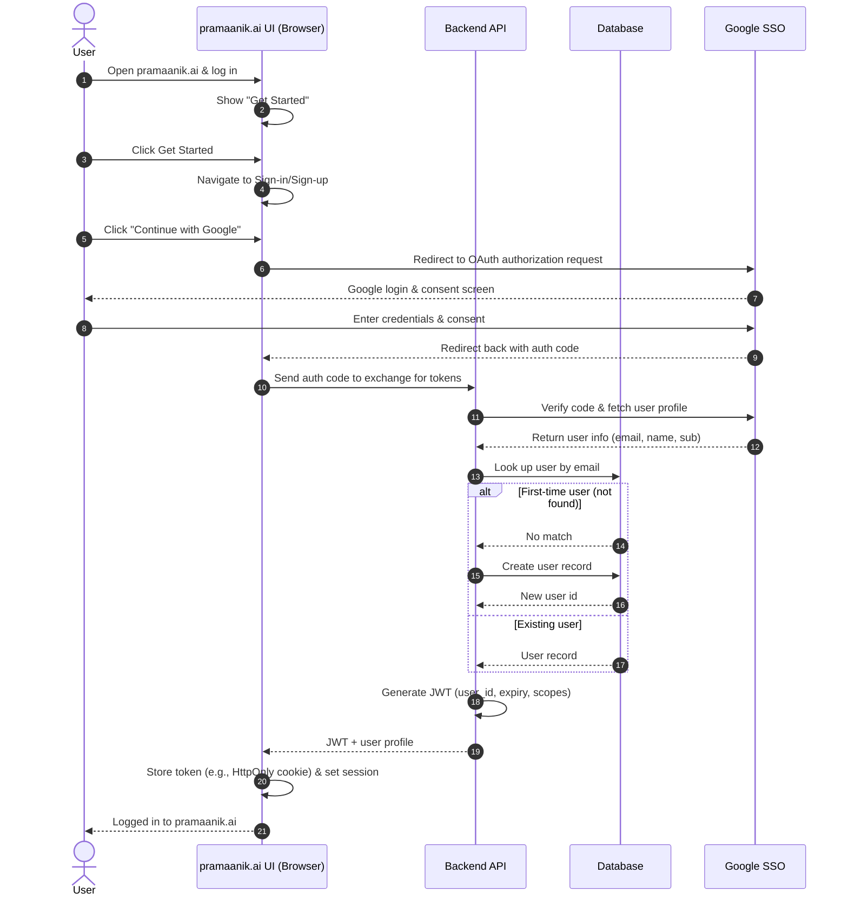

# Sign Up & Sign-In Controller

### 1) Sign-up or Sign-in with Google

```mermaid
sequenceDiagram
autonumber
actor U as User
participant UI as pramaanik.ai UI (Browser)
participant BE as Backend API
participant DB as Database
participant G as Google SSO

U->>UI: Open pramaanik.ai & log in
UI->>UI: Show "Get Started"
U->>UI: Click Get Started
UI->>UI: Navigate to Sign-in/Sign-up
U->>UI: Click "Continue with Google"
UI->>G: Redirect to OAuth authorization request
G-->>U: Google login & consent screen
U->>G: Enter credentials & consent
G-->>UI: Redirect back with auth code
UI->>BE: Send auth code to exchange for tokens
BE->>G: Verify code & fetch user profile
G-->>BE: Return user info (email, name, sub)
BE->>DB: Look up user by email
alt First-time user (not found)
  DB-->>BE: No match
  BE->>DB: Create user record
  DB-->>BE: New user id
else Existing user
  DB-->>BE: User record
end
BE->>BE: Generate JWT (user_id, expiry, scopes)
BE-->>UI: JWT + user profile
UI->>UI: Store token (e.g., HttpOnly cookie) & set session
UI-->>U: Logged in to pramaanik.ai

```
